# Hadoop on Virtual Machine

## 1. Operating System

```
bigdata@bd-vm:~$ lsb_release -a

No LSB modules are available.
Distributor ID    :   Ubuntu
Description       :   Ubuntu Mantic Minotaur (development branch)
Release           :   23.10
Codename          :   mantic
```

## 2. Java

```
$ java -version

Openjdk version "17.0.8" 2023-07-18
OpenJDK Runtime Environment (build 17.0.8+7-Ubuntu-1)
OpenJDK 64-Bit Server VM (build 17.0.8+7-Ubuntu-1, mixed mode, sharing)
```

Change java version

```
$ sudo update-alternatives --config java

There are 2 choices for the alternative java (providing /usr/bin/java).

  Selection    Path                                            Priority   Status
------------------------------------------------------------
  0            /usr/lib/jvm/java-17-openjdk-amd64/bin/java      1711      auto mode
* 1            /usr/lib/jvm/java-17-openjdk-amd64/bin/java      1711      manual mode
  2            /usr/lib/jvm/java-8-openjdk-amd64/jre/bin/java   1081      manual mode

Press <enter> to keep the current choice[*], or type selection number: 
```

## 3. Hadoop Architecture

### 3.1 Introduction

Apache Hadoop is an exceptionally successful framework that manages to solve the many challenges posed by big data. This efficient solution distributes storage and processing power across thousands of nodes within a cluster. A fully developed Hadoop platform includes a collection of tools that enhance the core Hadoop framework and enable it to overcome any obstacle.

The underlying architecture and the role of the many available tools in a [Hadoop ecosystem](HadoopEcosystem.md) can prove to be complicated for newcomers.

### 3.2 Overview of Hadoop Architecture

Big data, with its immense volume and varying [data structures](DataStructure.md) has overwhelmed traditional networking frameworks and tools. Using high-performance hardware and specialized servers can help, but they are inflexible and come with a considerable price tag.

Hadoop manages to process and store vast amounts of data by using interconnected affordable commodity hardware. Hundreds or even thousands of low-cost dedicated servers working together to store and process data within a single ecosystem.

[The Hadoop Distributed File System (HDFS)](HDFS.md), **YARN**, and **MapReduce** are at the heart of that ecosystem. HDFS is a set of protocols used to store large data sets, while MapReduce efficiently processes the incoming data.

A Hadoop cluster consists of one, or several, Master Nodes and many more so-called Slave Nodes. HDFS and MapReduce form a flexible foundation that can linearly scale out by adding additional nodes. However, the complexity of big data means that there is always room for improvement.

**Yet Another Resource Negotiator (YARN)** was created to improve resource management and scheduling processes in a Hadoop cluster. The introduction of YARN, with its generic interface, opened the door for other data processing tools to be incorporated into the Hadoop ecosystem.

A vibrant developer community has since created numerous open-source [Apache](Apache.md) projects to complement Hadoop. Many of these solutions have catchy and creative names such as Apache Hive, Impala, Pig, Sqoop, Spark, and Flume. These tools compile and process various data types. They also provide user-friendly interfaces, messaging services, and improve cluster processing speeds.

An expanded software stack, with HDFS, YARN, and MapReduce at its core, makes Hadoop the go-to solution for processing big data.

### 3.3 Understanding the Layers of Hadoop Architecture

Separating the elements of distributed systems into functional layers helps streamline data management and development. Developers can work on frameworks without negatively impacting other processes on the broader ecosystem.

Hadoop can be divided into four (4) distinctive layers.

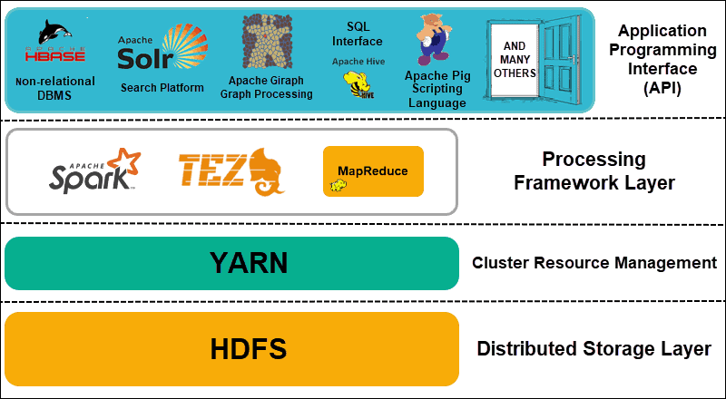

#### 3.3.1 Distributed Storage Layer

Each node in a Hadoop cluster has its own disk space, memory, bandwidth, and processing. The incoming data is split into individual data blocks, which are then stored within the HDFS distributed storage layer. HDFS assumes that every disk drive and slave node within the cluster is unreliable. As a precaution, HDFS stores three copies of each data set throughout the cluster. The HDFS master node (**NameNode**) keeps the metadata for the individual data block and all its replicas.

#### 3.3.2 Cluster Resource Management

Hadoop needs to coordinate nodes perfectly so that countless applications and users effectively share their resources. Initially, MapReduce handled both resource management and data processing. YARN separates these two functions. As the de-facto resource management tool for Hadoop, YARN is now able to allocate resources to different frameworks written for Hadoop. These include projects such as Apache Pig, Hive, Giraph, Zookeeper, as well as MapReduce itself.

#### 3.3.3 Processing Framework Layer

The processing layer consists of frameworks that analyze and process datasets coming into the cluster. The [structured and unstructured datasets](Structured-vs-Unstructured-Data.md) are mapped, shuffled, sorted, merged, and reduced into smaller manageable data blocks. These operations are spread across multiple nodes as close as possible to the servers where the data is located. Computation frameworks such as Spark, Storm, Tez now enable real-time processing, interactive query processing and other programming options that help the MapReduce engine and utilize HDFS much more efficiently.

#### 3.3.4 Application Programming Interface

The introduction of YARN in Hadoop 2 has lead to the creation of new processing frameworks and APIs. Big data continues to expand and the variety of tools needs to follow that growth. Projects that focus on search platforms, [data streaming](Spark-Streaming.md), user-friendly interfaces, programming languages, messaging, failovers, and security are all an intricate part of a comprehensive Hadoop ecosystem.

### 3.4 HDFS Explained

The Hadoop Distributed File System (HDFS) is fault-tolerant by design. Data is stored in individual data blocks in three separate copies across multiple nodes and server racks. If a node or even an entire rack fails, the impact on the broader system is negligible.

**DataNodes** process and store data blocks, while **NameNodes** manage the many DataNodes, maintain data block metadata, and control client access.

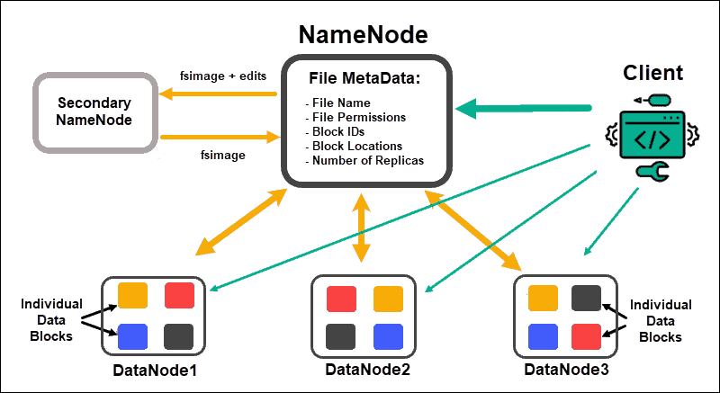

#### 3.4.1 NameNode

Initially, data is broken into abstract data blocks. The file metadata for these blocks, which include the file name, file permissions, IDs, locations, and the number of replicas, are stored in a fsimage, on the NameNode local memory.

Should a NameNode fail, HDFS would not be able to locate any of the data sets distributed throughout the DataNodes. This makes the NameNode the single point of failure for the entire cluster. This vulnerability is resolved by implementing a Secondary NameNode or a Standby NameNode.

##### Secondary NameNode

The Secondary NameNode served as the primary backup solution in early Hadoop versions. The Secondary NameNode, every so often, downloads the current fsimage instance and edit logs from the NameNode and merges them. The edited fsimage can then be retrieved and restored in the primary NameNode.

The failover is not an automated process as an administrator would need to recover the data from the Secondary NameNode manually.

##### Standby NameNode

The **High Availability** feature was introduced in Hadoop 2.0 and subsequent versions to avoid any downtime in case of the NameNode failure. This feature allows you to maintain two NameNodes running on separate dedicated master nodes.

The Standby NameNode is an automated failover in case an Active NameNode becomes unavailable. The Standby NameNode additionally carries out the check-pointing process. Due to this property, the Secondary and Standby NameNode are not compatible. A Hadoop cluster can maintain either one or the other.

##### Zookeeper

Zookeeper is a lightweight tool that supports high availability and redundancy. A Standby NameNode maintains an active session with the Zookeeper daemon.

If an Active NameNode falters, the Zookeeper daemon detects the failure and carries out the failover process to a new NameNode. Use Zookeeper to automate failovers and minimize the impact a NameNode failure can have on the cluster.

### 3.4.2 DataNode

Each DataNode in a cluster uses a background process to store the individual blocks of data on slave servers.

By default, HDFS stores three copies of every data block on separate DataNodes. The NameNode uses a rack-aware placement policy. This means that the DataNodes that contain the data block replicas cannot all be located on the same server rack.

A DataNode communicates and accepts instructions from the NameNode roughly twenty times a minute. Also, it reports the status and health of the data blocks located on that node once an hour. Based on the provided information, the NameNode can request the DataNode to create additional replicas, remove them, or decrease the number of data blocks present on the node.

### 3.4.3 Rack Aware Placement Policy

One of the main objectives of a distributed storage system like HDFS is to maintain high availability and replication. Therefore, data blocks need to be distributed not only on different DataNodes but on nodes located on different server racks.

This ensures that the failure of an entire rack does not terminate all data replicas. The HDFS NameNode maintains a default rack-aware replica placement policy:

- The first data block replica is placed on the same node as the client.
- The second replica is automatically placed on a random DataNode on a different rack.
- The third replica is placed in a separate DataNode on the same rack as the second replica.
- Any additional replicas are stored on random DataNodes throughout the cluster.

This rack placement policy maintains only one replica per node and sets a limit of two replicas per server rack.


Rack failures are much less frequent than node failures. HDFS ensures high reliability by always storing at least one data block replica in a DataNode on a different rack.

### 3.5 YARN Explained

YARN (Yet Another Resource Negotiator) is the default cluster management resource for Hadoop 2 and Hadoop 3. In previous Hadoop versions, MapReduce used to conduct both data processing and resource allocation. Over time the necessity to split processing and resource management led to the development of YARN.

YARN’s resource allocation role places it between the storage layer, represented by HDFS, and the MapReduce processing engine. YARN also provides a generic interface that allows you to implement new processing engines for various data types.

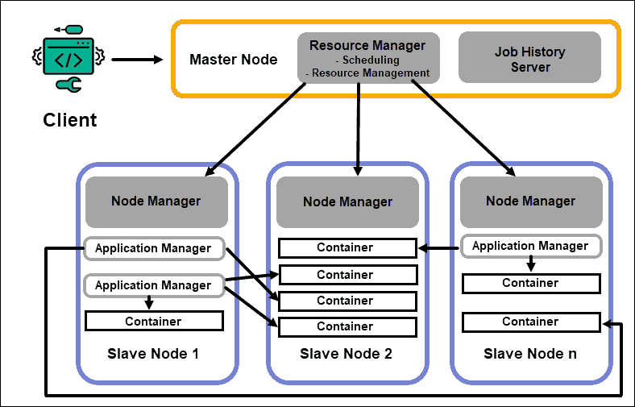

#### 3.5.1 ResourceManager

The ResourceManager (RM) daemon controls all the processing resources in a Hadoop cluster. Its primary purpose is to designate resources to individual applications located on the slave nodes. It maintains a global overview of the ongoing and planned processes, handles resource requests, and schedules and assigns resources accordingly. The ResourceManager is vital to the Hadoop framework and should run on a dedicated master node.

The RM sole focus is on scheduling workloads. Unlike MapReduce, it has no interest in failovers or individual processing tasks. This separation of tasks in YARN is what makes Hadoop inherently scalable and turns it into a fully developed computing platform.

#### 3.5.2 NodeManager

Each slave node has a NodeManager processing service and a DataNode storage service. Together they form the backbone of a Hadoop distributed system.

The DataNode, as mentioned previously, is an element of HDFS and is controlled by the NameNode. The NodeManager, in a similar fashion, acts as a slave to the ResourceManager. The primary function of the NodeManager daemon is to track processing-resources data on its slave node and send regular reports to the ResourceManager.

**Note:** YARN daemons and containers are Java processes working in Java VMs.

#### 3.5.3 Containers

Processing resources in a Hadoop cluster are always deployed in containers. A container has memory, system files, and processing space.

A container deployment is generic and can run any requested custom resource on any system. If a requested amount of cluster resources is within the limits of what’s acceptable, the RM approves and schedules that container to be deployed.

The container processes on a slave node are initially provisioned, monitored, and tracked by the NodeManager on that specific slave node.

#### 3.5.4 Application Master

Every container on a slave node has its dedicated Application Master. Application Masters are deployed in a container as well. Even MapReduce has an Application Master that executes map and reduce tasks.

As long as it is active, an Application Master sends messages to the Resource Manager about its current status and the state of the application it monitors. Based on the provided information, the Resource Manager schedules additional resources or assigns them elsewhere in the cluster if they are no longer needed.

The Application Master oversees the full lifecycle of an application, all the way from requesting the needed containers from the RM to submitting container lease requests to the NodeManager.

#### 3.5.5 JobHistory Server

The JobHistory Server allows users to retrieve information about applications that have completed their activity. The REST API provides interoperability and can dynamically inform users on current and completed jobs served by the server in question.

#### 3.5.6 How Does YARN Work?

A basic workflow for deployment in YARN starts when a client application submits a request to the ResourceManager.

1. The **ResourceManager** instructs a **NodeManager** to start an **Application Master** for this request, which is then started in a container.
2. The newly created **Application Master** registers itself with the **RM**. The Application Master proceeds to contact the **HDFS NameNode** and determine the location of the needed data blocks and calculates the amount of map and reduce tasks needed to process the data.
3. The **Application Master** then requests the needed resources from the **RM** and continues to communicate the resource requirements throughout the life-cycle of the container.
4. The **RM** schedules the resources along with the requests from all the other **Application Masters** and queues their requests. As resources become available, the RM makes them available to the Application Master on a specific slave node.
5. The **Application Manager** contacts the **NodeManager** for that slave node and requests it to create a container by providing variables, authentication tokens, and the command string for the process. Based on that request, the **NodeManager** creates and starts the **container**.
6. The **Application Manager** then monitors the process and reacts in the event of failure by restarting the process on the next available slot. If it fails after four different attempts, the entire job fails. Throughout this process, the Application Manager responds to client status requests.

Once all tasks are completed, the Application Master sends the result to the client application, informs the RM that the application has completed its task, deregisters itself from the Resource Manager, and shuts itself down.

The RM can also instruct the NameNode to terminate a specific container during the process in case of a processing priority change.

### 3.6 MapReduce Explained

MapReduce is a programming algorithm that processes data dispersed across the Hadoop cluster. As with any process in Hadoop, once a MapReduce job starts, the ResourceManager requisitions an Application Master to manage and monitor the MapReduce job lifecycle.

The Application Master locates the required data blocks based on the information stored on the NameNode. The AM also informs the ResourceManager to start a MapReduce job on the same node the data blocks are located on. Whenever possible, data is processed locally on the slave nodes to reduce bandwidth usage and improve cluster efficiency.

The input data is mapped, shuffled, and then reduced to an aggregate result. The output of the MapReduce job is stored and replicated in HDFS.


he Hadoop servers that perform the mapping and reducing tasks are often referred to as **Mappers** and **Reducers**.

The ResourceManager decides how many mappers to use. This decision depends on the size of the processed data and the memory block available on each mapper server.

**Note:** Check out our in-depth guide on [what is MapReduce and how does it work](HadoopMapReduce.md).

#### 3.6.1 Map Phase

The mapping process ingests individual logical expressions of the data stored in the HDFS data blocks. These expressions can span several data blocks and are called **input splits***.* Input splits are introduced into the mapping process as *key-value pairs*.

A mapper task goes through every key-value pair and creates a new set of key-value pairs, distinct from the original input data. The complete assortment of all the key-value pairs represents the output of the mapper task.

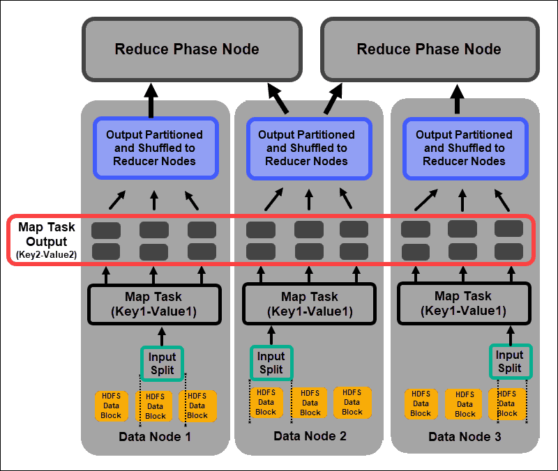

Based on the key from each pair, the data is grouped, partitioned, and shuffled to the reducer nodes.

#### 3.6.2 Shuffle and Sort Phase

**Shuffle** is a process in which the results from all the map tasks are copied to the reducer nodes. The copying of the map task output is the only exchange of data between nodes during the entire MapReduce job.

**Note:** Output produced by map tasks is stored on the mapper node’s local disk and not in HDFS. This means that the data is not part of the Hadoop replication process and rack placement policy.

The output of a map task needs to be arranged to improve the efficiency of the reduce phase. The mapped key-value pairs, being shuffled from the mapper nodes, are arrayed by key with corresponding values. A reduce phase starts after the input is **sorted** by key in a single input file.

The shuffle and sort phases run in parallel. Even as the map outputs are retrieved from the mapper nodes, they are grouped and sorted on the reducer nodes.

#### 3.6.3 Reduce Phase

The map outputs are shuffled and sorted into a single reduce input file located on the reducer node. A reduce function uses the input file to aggregate the values based on the corresponding mapped keys. The output from the reduce process is a new key-value pair. This result represents the output of the entire MapReduce job and is, by default, stored in HDFS.

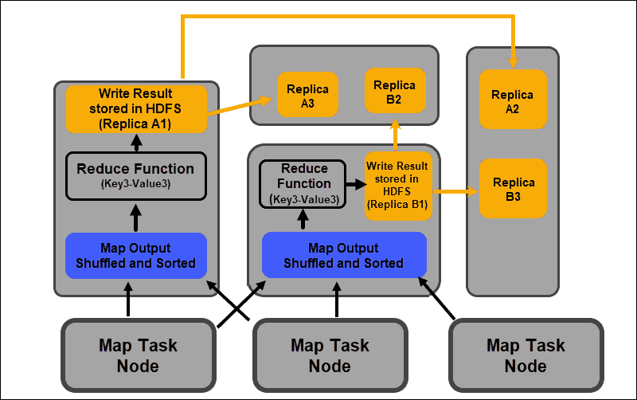

All reduce tasks take place simultaneously and work independently from one another. A reduce task is also optional.

There can be instances where the result of a map task is the desired result and there is no need to produce a single output value.

### 3.7 Best Practices for Deploying Hadoop

The following section explains how underlying hardware, user permissions, and maintaining a balanced and reliable cluster can help you get more out of your Hadoop ecosystem.

#### 3.7.1 Adjust Hadoop User Permissions

The Kerberos network protocol is the chief authorization system in Hadoop. It makes sure that only verified nodes and users have access and operate within the cluster.

Once you install and configure a Kerberos Key Distribution Center, you need to make several changes to the Hadoop configuration files. The Hadoop *core-site.xml* file defines parameters for the entire Hadoop cluster. Set the **`hadoop.security.authentication`** parameter within the *core-site.xml* to **`kerberos`***.* The same property needs to be set to **`true`** to enable service authorization.

Access control lists in the *hadoop-policy-xml* file can also be edited to grant different access levels to specific users. Striking a balance between necessary user privileges and giving too many privileges can be difficult with basic command-line tools.

It is a good idea to use additional security frameworks such as **Apache** **Ranger** or **Apache Sentry**. These tools help you manage all security-related tasks from a central, user-friendly environment. Use them to provide specific authorization for tasks and users while keeping complete control over the process.

#### 3.7.2 Balanced Hadoop Cluster

A distributed system like Hadoop is a dynamic environment. Adding new nodes or removing old ones can create a temporary imbalance within a cluster. Data blocks can become under-replicated.

Your goal is to spread data as consistently as possible across the slave nodes in a cluster. Use the Hadoop cluster-balancing utility to change predefined settings. Define your balancing policy with the **`hdfs balancer`** command. This command and its options allow you to modify node disk capacity thresholds.

The default block size starting from Hadoop 2.x is 128MB. Hadoop allows a user to change this setting. Consider changing the default data block size if processing sizable amounts of data; otherwise, the number of started jobs could overwhelm your cluster.

If you increase the data block size, the input to the map task is going to be larger, and there are going to be fewer map tasks started. This, in turn, means that the shuffle phase has much better throughput when transferring data to the reducer node. This simple adjustment can decrease the time it takes a MapReduce job to complete.

#### 3.7.3 Scaling Hadoop (Hardware)

The NameNode is a vital element of your Hadoop cluster. Engage as many processing cores as possible for this node. The amount of RAM defines how much data gets read from the node’s memory. If you overtax the resources available to your Master Node, you restrict the ability of your cluster to grow.

Redundant power supplies should always be reserved for the Master Node. Try not to employ redundant power supplies and valuable hardware resources for data nodes. They are an important part of a Hadoop ecosystem, however, they are expendable. Affordable dedicated servers, with intermediate processing capabilities, are ideal for data nodes as they consume less power and produce less heat.

Hadoop’s scaling capabilities are the main driving force behind its widespread implementation. It is necessary always to have enough space for your cluster to expand. Quickly adding new nodes or disk space requires additional power, networking, and cooling. All this can prove to be very difficult without meticulously [planning for likely future growth](future-proof-your-it-strategy.md).

#### 3.7.4 Scaling Hadoop (Software)

New Hadoop-projects are being developed regularly and existing ones are improved with more advanced features.

Even legacy tools are being upgraded to enable them to benefit from a Hadoop ecosystem. Always keep an eye out for new developments on this front. The variety and volume of incoming data sets mandate the introduction of additional frameworks.

Implementing a new user-friendly tool can solve a technical dilemma faster than trying to create a custom solution. Do not shy away from already developed commercial quick fixes. The market is saturated with vendors offering Hadoop-as-a-service or tailored standalone tools.

#### 3.7.5 Data Reliability and Fault Toleration

H*eartbeat* is a recurring TCP handshake signal. DataNodes, located on each slave server, continuously send a heartbeat to the NameNode located on the master server. The default heartbeat time-frame is three seconds. If the NameNode does not receive a signal for more than ten minutes, it writes the DataNode off, and its data blocks are auto-scheduled on different nodes.

Do not lower the heartbeat frequency to try and lighten the load on the NameNode. Keeping NameNodes ‘informed’ is crucial, even in extremely large clusters. Without a regular and frequent heartbeat influx, the NameNode is severely hampered and cannot control the cluster as effectively.

To avoid serious fault consequences, keep the default rack awareness settings and store replicas of data blocks across server racks. If you lose a server rack, the other replicas survive, and the impact on data processing is minimal.

## 4. Hadoop

### 4.1 Hadoop Installation

Download the Binary Hadoop : https://hadoop.apache.org/releases.html

Extract the downloaded file using the following command:
*tar -xvzf hadoop-3.3.6.tar.gz*

Move hadopp-3.3.6 folder into ~/apache folder and rename to hadoop 

```
$ mv ~/Downloads/hadoop-3.3.6 ~/apache/hadoop
```

Edit ~/.bashrc file. Add the following parameters:

```
 export HADOOP_HOME=~/apache/hadoop
 export PATH=$PATH:$HADOOP_HOME/bin
```

Refresh the contents of the bashrc file

```
$ source ~/.bashrc
```

Run the following commands to test the Hadoop binaries and make sure the binaries works on our local
machine:

    $ cd $HADOOP_HOME
    $ mkdir input
    $ cp etc/hadoop/.xml input bin/hadoop jar share/hadoop/mapreduce/hadoop-mapreduceexamples-3.3.6.jar grep input output 'dfs[a-z.]+'
    $ cat output/

If everything runs as expected, you will see an output directory showing some output, which shows that the sample command worked.

### 4.2 Enable Passwordless SSH for Hadoop user

Check if you can ssh to the localhost without a passphrase by running a simple command, shown as follows:

```
$ ssh localhost
```

If you cannot ssh to localhost without a passphrase, execute the following commands:

```
$ ssh-keygen -t rsa -P '' -f ~/.ssh/id_rsa
$ cat ~/.ssh/id_rsa.pub >> ~/.ssh/authorized_keys
$ chmod 0600 ~/.ssh/authorized_key
```

### 4.3 Single Node Hadoop Deployment (Pseudo-Distributed Mode)

Hadoop excels when deployed in a **fully distributed mode** on a large cluster of networked servers*.* However, if you are new to Hadoop and want to explore basic commands or test applications, you can configure Hadoop on a single node.

This setup, also called **pseudo-distributed mode**, allows each Hadoop daemon to run as a single Java process. A Hadoop environment is configured by editing a set of configuration files:

- .bashrc
- hadoop-env.sh
- core-site.xml
- hdfs-site.xml
- mapred-site-xml
- yarn-site.xml

#### 4.3.1 Configure Hadoop Environment Variables (.bashrc)

```
sudo nano ~/.bashrc
```

Define the Hadoop environment variables by adding the following content to the end of the file: 

```
# Hadoop Related Options
export JAVA_HOME=/usr/lib/jvm/java-17-openjdk-amd64
export APACHE_HOME=~/apache
export HADOOP_HOME=~/apache/hadoop
export HADOOP_MAPRED_HOME=${HADOOP_HOME}
export HADOOP_COMMON_HOME=${HADOOP_HOME}
export HADOOP_HDFS_HOME=${HADOOP_HOME}
export YARN_HOME=${HADOOP_HOME}
export PATH=$PATH:$JAVA_HOME/bin:$HADOOP_HOME/bin:$HADOOP_HOME/sbin
```

It is vital to apply the changes to the current running environment by using the following command:

```
source ~/.bashrc
```

#### 4.3.2 Edit hadoop-env.sh File

The *hadoop-env.sh* file serves as a master file to configure YARN, [HDFS](HDFS.md), [MapReduce](HadoopMapReduce.md), and Hadoop-related project settings.

When setting up a **single node Hadoop cluster**, you need to define which Java implementation is to be utilized. Use the previously created **`$HADOOP_HOME`** variable to access the *hadoop-env.sh* file

If you need help to locate the correct Java path, run the following command in your terminal window:

```
$ which javac
/usr/bin/javac
$ readlink -f /usr/bin/javac
/usr/lib/jvm/java-8-openjdk-amd64/bin/javac
```

Set JAVA_HOME=/usr/lib/jvm/java-8-openjdk-amd64

```
sudo nano $HADOOP_HOME/etc/hadoop/hadoop-env.sh
```

Uncomment the **`$JAVA_HOME`** variable (i.e., remove the **`#`** sign) and add the full path to the OpenJDK installation on your system. If you have installed the same version as presented in the first part of this tutorial, add the following line:

```
export JAVA_HOME=/usr/lib/jvm/java-8-openjdk-amd64
```

#### 4.3.3 Edit core-site.xml File

The *core-site.xml* file defines HDFS and Hadoop core properties.

To set up Hadoop in a pseudo-distributed mode, you need to **specify the URL** for your NameNode, and the temporary directory Hadoop uses for the map and reduce process.

Open the *core-site.xml* file in a text editor:

```
sudo nano $HADOOP_HOME/etc/hadoop/core-site.xml
```

Edit or Add the following configuration to override the default values for the temporary directory and add your HDFS URL to replace the default local file system setting:

```
<configuration>
    <property>
        <name>fs.defaultFS</name>
        <value>hdfs://localhost:9000</value>
    </property>
</configuration>
```

#### 4.3.4 Edit hdfs-site.xml File

The properties in the *hdfs-site.xml* file govern the location for storing node metadata, fsimage file, and edit log file. Configure the file by defining the **NameNode** and **DataNode storage directories**.

Additionally, the default **`dfs.replication`** value of **`3`** needs to be changed to **`1`** to match the single node setup.

Use the following command to open the *hdfs-site.xml* file for editing:

```
sudo nano $HADOOP_HOME/etc/hadoop/hdfs-site.xml
```

Add the following configuration to the file and, if needed, adjust the NameNode and DataNode directories to your custom locations:

```
<configuration>

     <property>
          <name>dfs.replication</name>
          <value>1</value>
     </property>

     <property>
       <name>dfs.name.dir</name>
        <value>/home/bigdata/apache/dfs/name</value>
     </property>

     <property>
       <name>dfs.data.dir</name>
        <value>/home/bigdata/apache/dfs/data</value>
     </property>

     <property>
       <name>fs.checkpoint.dir</name>
        <value>/home/bigdata/apache/dfs/namesecondary</value>
     </property>

</configuration>
```

#### 4.3.5 Edit mapred-site.xml File

Use the following command to access the *mapred-site.xml* file and **define MapReduce values**:

```
sudo nano $HADOOP_HOME/etc/hadoop/mapred-site.xml
```

Add the following configuration to change the default MapReduce framework name value to **`yarn`**:

```
<configuration>
<property>
  <name>mapreduce.framework.name</name>
  <value>yarn</value>
</property>
</configuration>
```

#### 4.4.6 Edit yarn-site.xml File

The *yarn-site.xml* file is used to define settings relevant to **YARN**. It contains configurations for the **Node Manager, Resource Manager, Containers,** and **Application Master**.

Open the *yarn-site.xml* file in a text editor:

```
sudo nano $HADOOP_HOME/etc/hadoop/yarn-site.xml
```

Append the following configuration to the file:

```
<configuration>
<property>
  <name>yarn.nodemanager.aux-services</name>
  <value>mapreduce_shuffle</value>
</property>
<property>
  <name>yarn.nodemanager.aux-services.mapreduce.shuffle.class</name>
  <value>org.apache.hadoop.mapred.ShuffleHandler</value>
</property>
<property>
  <name>yarn.resourcemanager.hostname</name>
  <value>127.0.0.1</value>
</property>
<property>
  <name>yarn.acl.enable</name>
  <value>0</value>
</property>
<property>
  <name>yarn.nodemanager.env-whitelist</name>   
  <value>JAVA_HOME,HADOOP_COMMON_HOME,HADOOP_HDFS_HOME,YARN_HOME,HADOOP_MAPRED_HOME</value>
</property>
</configuration>
```

### 4.4 Create directories

- dfs.data.dir
  
  ```
  mkdir -p /home/bigdata/apache/dfs/data
  ```

- fs.checkpoint.dir
  
  ```
  mkdir -p /home/bigdata/apache/dfs/data
  ```

### 4.5 Format HDFS NameNode

It is important to **format the NameNode** before starting Hadoop services for the first time: 

```
$ hdfs namenode -format
```

### 4.6 Start Hadoop Cluster

Navigate to the *hadoop-3.2.1/sbin* directory and execute the following commands to start the NameNode and DataNode:

```
$ start-dfs.sh
```

The Hadoop daemon log output is written to the 

$HADOOP_LOG_DIR directory

(*defaults to $HADOOP_HOME/logs*).

- Check Hadoop Services

```
$ jps

bigdata@bd-vm:~/apache/hadoop$ jps |grep -vi jps
4256 NameNode
4597 SecondaryNameNode
4395 DataNode
```

- Make the HDFS directories required to execute MapReduce jobs:

```
$ hdfs dfs -mkdir /user
$ hdfs dfs -mkdir /user/bigdata
```

### 4.7 Access Hadoop UI from Browser

Open a browser to check your local Hadoop, which can be launched in the
browser as http://localhost:9870

```
http://localhost:9870
```

The following is what the HDFS installation looks like:

           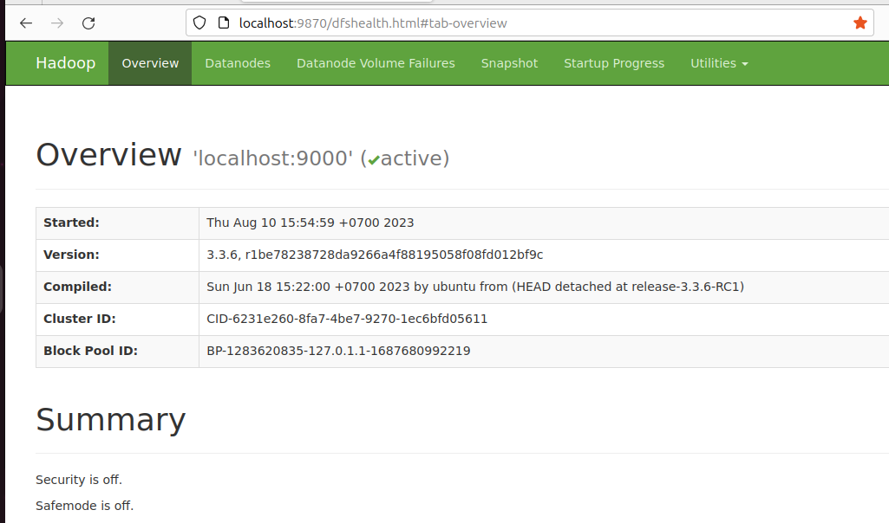

Clicking on the Datanodes tab shows the nodes as shown in the following
screenshot:

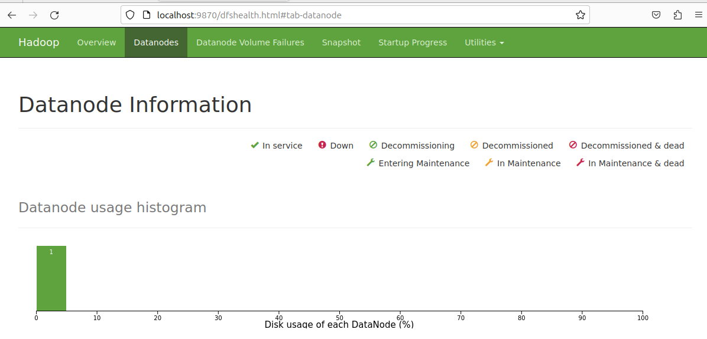

Click Startup Progress


Clicking on the logs will show the various logs in your cluster, as shown in the
following screenshot: 

Utilities ==> Logs

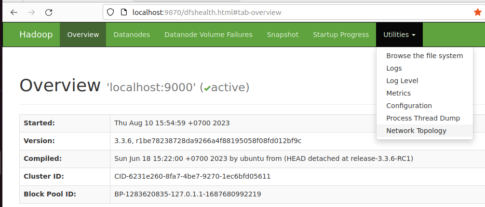

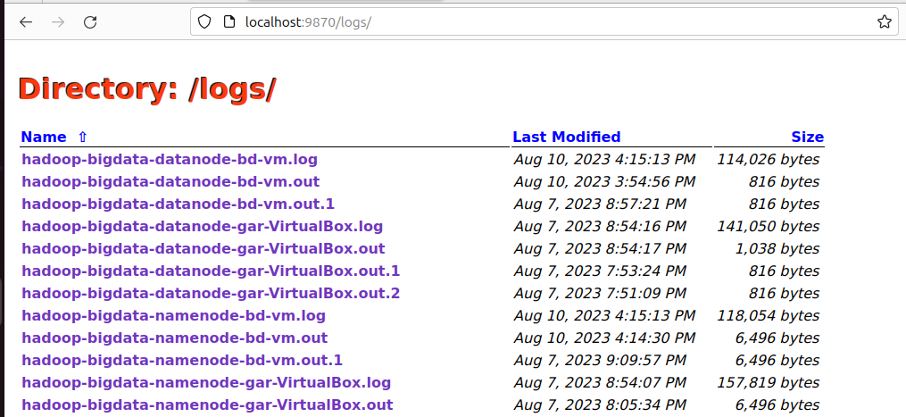

Utilities ==> Configuration

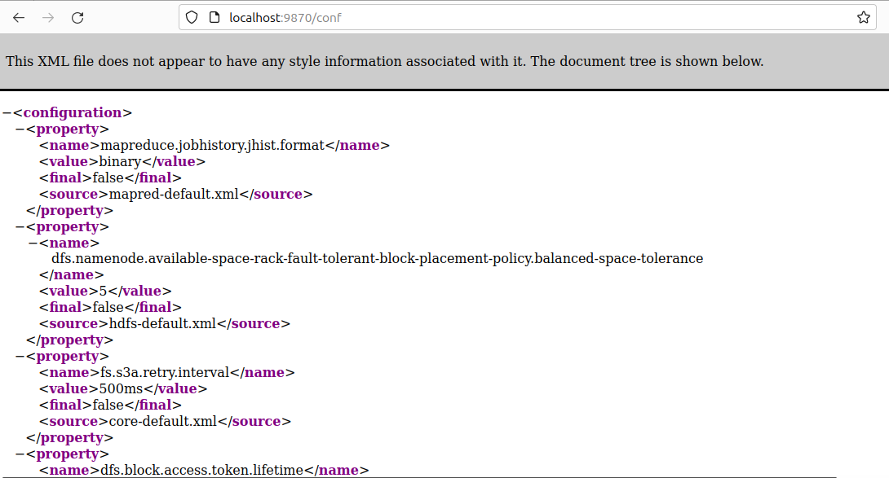

At this point, we should all be able to see and use a basic HDFS cluster. But this is just a
HDFS filesystem with some directories and files. We also need a job/task scheduling service to actually use the cluster for computational needs rather than just storage.

The default port **9864** is used to access individual DataNodes directly from your browser:

```
http://localhost:9864
```

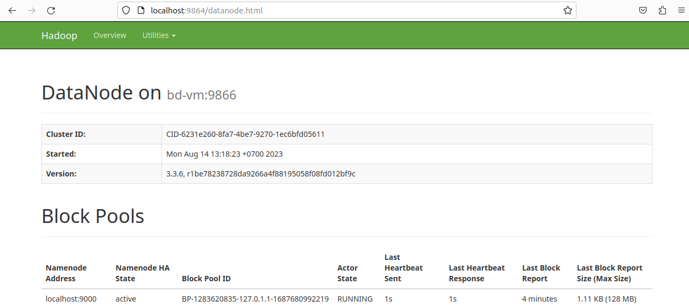

## 5. YARN

### 5.1 Starting YARN

In this section, we will set up a YARN service and start the components needed to run and operate a YARN cluster:

Start the ResourceManager daemon and the NodeManager daemon:

```
$ start-yarn.sh
```

Check YARN  service (ResourceManager)

```
$ jps | grep -vi jps

4256 NameNode
4597 SecondaryNameNode
4395 DataNode
6047 ResourceManager
```

### 5.2 Access YARN UI from Browser

The following is the YARN ResourceManager.


At this time, we should be able to see the running YARN service in our local cluster
running Hadoop 3.1.0. Next, we will look at some new features in Hadoop 3.x.

### 5.3 Erasure Coding

EC is a key change in Hadoop 3.x promising a significant improvement in HDFS utilization efficiencies as compared to earlier versions where replication factor of 3 for instance caused immense wastage of precious cluster file system for all kinds of data no matter what the relative importance was to the tasks at hand.
EC can be setup using policies and assigning the policies to directories in HDFS. For this, HDFS provides an ec subcommand to perform administrative commands related to EC:

```
$ hdfs ec -help
```

hdfs ec [generic options]
[-setPolicy -path <path> [-policy <policyName>] [-replicate]]
[-getPolicy -path <path>]
[-unsetPolicy -path <path>]

[-listPolicies]
[-addPolicies -policyFile <file>]
[-listCodecs]
[-enablePolicy -policy <policyName>]
[-disablePolicy -policy <policyName>]
[-help [cmd ...]]

By using -listPolicies, you can list all the EC policies currently setup in your cluster
along with the state of such policies whether they are ENABLED or DISABLED:


Lets test out EC in our cluster. First we will create directories in the HDFS shown as follows:

```
$ hdfs dfs -mkdir /user/normal
$ hdfs dfs -mkdir /user/ec
```

Once the two directories are created then you can set the policy on any path:

```
$ hdfs ec -setPolicy -path /user/ec -policy RS-6-3-1024k
```


Now copying any content into the /user/ec folder falls into the newly set policy.
Type the command shown as follows to test this:

```
$ hdfs dfs -copyFromLocal ~/Documents/OnlineRetail.csv /user/ec
```

The following screenshot shows the result of the copying, as expected the system complains as we don't really have a cluster on our local system enough to implement EC. But this should give us an idea of what is needed and how it would look:


### 5.5 Intra-DataNode balancer

While HDFS always had a great feature of balancing the data between the data nodes in the cluster, often this resulted in skewed disks within data nodes. For instance, if you have four disks, two disks might take the bulk of the data and the other two might be under-utilized.
Given that physical disks (say 7,200 or 10,000 rpm) are slow to read/write, this kind of
skewing of data results in poor performance. Using an intra-node balancer, we can
rebalance the data amongst the disks.
Run the command shown in the following <u>example </u>to invoke disk balancing on a
DataNode to another cluster hostname :

```
hdfs diskbalancer -plan 10.0.2.17
```

## 6. HBase

Apache HBase™ is the Hadoop database. Use it when you need random, realtime read/write access to your Big Data

### 6.1 Installation

If you are intent on a simple deploy profile for the Apache HBase cluster where the data loading is light but the data needs to persist across node comings and goings, you could consider the Standalone HBase over HDFS deploy mode.

Download link to HBase 2.5.5 (example)

https://dlcdn.apache.org/hbase/2.5.5/hbase-2.5.5-bin.tar.gz

Download hbase-2.5.5-bin.tar.gz to your local machine. Then extract the HBase
binaries:

```
$ tar -xvzf hbase-2.5.5.-bin.tar.gz
```

This is a useful variation on the standalone HBase setup and has all HBase
daemons running inside one JVM but rather than persisting to the local filesystem, it
persists to an HDFS instance. Writing to HDFS where data is replicated ensures that data is persisted across node comings and goings. To configure this standalone variant, edit your hbase-site.xml setting the hbase.rootdir to point at a directory in your HDFS instance but then set hbase.cluster.distributed to false.

Move hbase-2.5.5. folder into ~/apache/, and rename to hbase.

```
$ mv ~/Downloads/hbase-2.5.5 ~/apache/hbase
```

The following is the **hbase**-**site.xml** with the hdfs port 9000 for the local cluster we
have installed mentioned as a property. If you leave this out there wont be a HBase
cluster installed.

```
<configuration>
  <!--
    The following properties are set for running HBase as a single process on a
    developer workstation. With this configuration, HBase is running in
    "stand-alone" mode and without a distributed file system. In this mode, and
    without further configuration, HBase and ZooKeeper data are stored on the
    local filesystem, in a path under the value configured for `hbase.tmp.dir`.
    This value is overridden from its default value of `/tmp` because many
    systems clean `/tmp` on a regular basis. Instead, it points to a path within
    this HBase installation directory.

    Running against the `LocalFileSystem`, as opposed to a distributed
    filesystem, runs the risk of data integrity issues and data loss. Normally
    HBase will refuse to run in such an environment. Setting
    `hbase.unsafe.stream.capability.enforce` to `false` overrides this behavior,
    permitting operation. This configuration is for the developer workstation
    only and __should not be used in production!__

    See also https://hbase.apache.org/book.html#standalone_dist
  -->
  <property> 
    <name>hbase.rootdir</name>
    <value>hdfs://localhost:9000/hbase</value>
  </property>
  <property>
    <name>hbase.cluster.distributed</name>
    <value>false</value>
  </property>
  <property>
    <name>hbase.wal.provider</name>
    <value>filesystem</value>
  </property>

</configuration>
```

### 6.2 Starting HBase

Make sure  the folowing parameters have been added in .bashrc file and  re-login (type source ~/bashrc) :

```
export HBASE_HOME=~/apache/hbase/
export PATH=$PATH:$HBASE_HOME/bin
```

We will do this by using start-hbase.sh script:

```
$ start-hbase.sh
```

### 6.3 Access HBase UI from Browser

http://localhost:16010

```
http://localhost:16010
```

The following screenshot shows the HBase cluster we just installed:

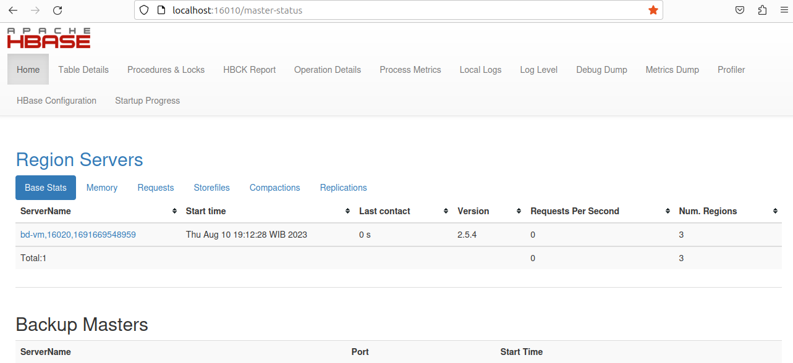

The following screenshot shows are more attributes of the HBase cluster setup showing versions, of various components:

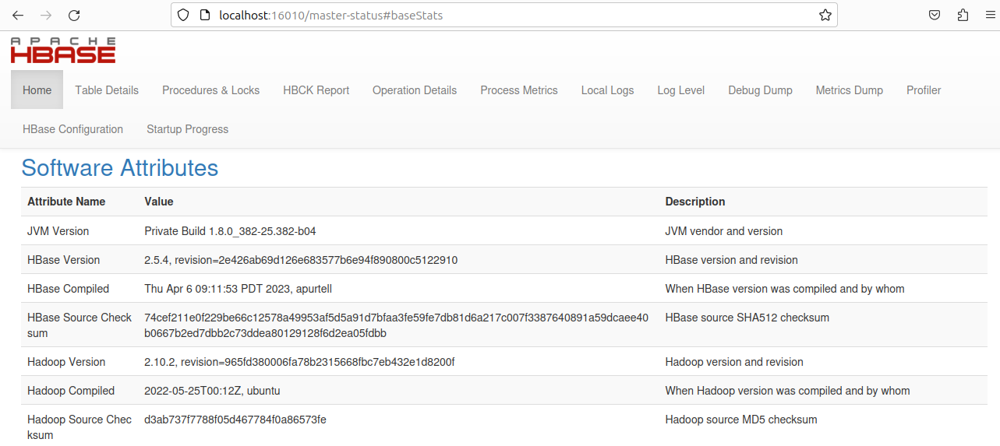


Startup Progress screenshot:


### 6.4 Using HBase

#### 6.4.1 Components Involved

- HDFS
- HBASE

#### 6.4.2 Sample Data

Import CSV data into HBase

In this post, we are having data in a CSV file. This file contains basic information about Employees. We want to import CSV data into HBase table.

Our sample data looks like below:

```
7369,SMITH,CLERK,7902,12/17/1980,800,20
7499,ALLEN,SALESMAN,7698,2/20/1981,1600,30
7521,WARD,SALESMAN,7698,2/22/1981,1250,30
7566,TURNER,MANAGER,7839,4/2/1981,2975,20
7654,MARTIN,SALESMAN,7698,9/28/1981,1250,30
7698,MILLER,MANAGER,7839,5/1/1981,2850,30
7782,CLARK,MANAGER,7839,6/9/1981,2450,10
7788,SCOTT,ANALYST,7566,12/9/1982,3000,20
7839,KING,PRESIDENT,NULL,11/17/1981,5000,10
7844,TURNER,SALESMAN,7698,9/8/1981,1500,30
7876,ADAMS,CLERK,7788,1/12/1983,1100,20
7900,JAMES,CLERK,7698,12/3/1981,950,30
7902,FORD,ANALYST,7566,12/3/1981,3000,20
7934,MILLER,CLERK,7782,1/23/1982,1300,10
```

You can download the sample data from this link [emp_data](https://bigdataprogrammers.com/wp-content/plugins/download-attachments/includes/download.php?id=2676 "emp_data").

#### 6.4.3 Solutions

We will go step-by-step in order to achieve our requirement with the given input.

##### Step 1: Input Data Preparation

Once we have the data in CSV format, we have to store it at a path from where it can get access by HBase that means we will keep input data in HDFS location. Currently, I am having a data file in local path, we will copy this to HDFS location using the command. In my case, I am copying file from local ‘*/home/bigdata/Downloads*‘ to HDFS ‘*/hbase/data*‘ path.

```
hdfs dfs -put ~/Downloads/emp_data.csv /hbase/data/
```

##### Step 2: Create HBase Table

In this step, we will create an HBase table to store the data. Let’s create this table based on the data we have in CSV file. Open HBase console using HBase shell and execute the query:

```
 create 'emp_data',{NAME => 'cf'}
```

Here, we have created an HBase table named emp_data with column family cf. All the columns of the CSV data will be store in cf family.

##### Step 3: Load data into HBase

We are done with data preparation and table creation. Now we have to load the data from HDFS to HBase. We will use below query:

```
hbase org.apache.hadoop.hbase.mapreduce.ImportTsv /
-Dimporttsv.separator=',' /
-Dimporttsv.columns='HBASE_ROW_KEY,cf:ename,cf:designation,cf:manager,cf:hire_date,cf:sal,cf:deptno' /
emp_data /hbase/data/emp_data.csv
```

Once we submit the job, a MapReduce job will get started. Let’s understand each argument in more details:

***-Dimporttsv.separator*** – Specify the delimiter of the source file

***-Dimporttsv.columns*** – Mentioned columns name. Here if you observe, we have not mentioned empno. The Rowkey will have empno value. The row key needs to be identified using the all-caps HBASE_ROW_KEY string; otherwise, it won’t start the job.

##### Step 4: Read data from HBase

Let’s check the data in HBase table.

bigdata@bd-vm:~$ *hbase shell*

```
hbase:004:0> scan 'emp_data'
ROW                           COLUMN+CELL                                                                         
 7369                         column=cf:deptno, timestamp=2023-08-11T11:27:15.068, value=20                       
 7369                         column=cf:designation, timestamp=2023-08-11T11:27:15.068, value=CLERK               
 7369                         column=cf:ename, timestamp=2023-08-11T11:27:15.068, value=SMITH                     
 7369                         column=cf:hire_date, timestamp=2023-08-11T11:27:15.068, value=12/17/1980            
 7369                         column=cf:manager, timestamp=2023-08-11T11:27:15.068, value=7902                    
 7369                         column=cf:sal, timestamp=2023-08-11T11:27:15.068, value=800                         
 7499                         column=cf:deptno, timestamp=2023-08-11T11:27:15.068, value=30                       
 7499                         column=cf:designation, timestamp=2023-08-11T11:27:15.068, value=SALESMAN            
 7499                         column=cf:ename, timestamp=2023-08-11T11:27:15.068, value=ALLEN                     
 7499                         column=cf:hire_date, timestamp=2023-08-11T11:27:15.068, value=2/20/1981             
 7499                         column=cf:manager, timestamp=2023-08-11T11:27:15.068, value=7698                    
 7499                         column=cf:sal, timestamp=2023-08-11T11:27:15.068, value=1600                        
 7521                         column=cf:deptno, timestamp=2023-08-11T11:27:15.068, value=30                       
 7521                         column=cf:designation, timestamp=2023-08-11T11:27:15.068, value=SALESMAN            
 7521                         column=cf:ename, timestamp=2023-08-11T11:27:15.068, value=WARD                      
 7521                         column=cf:hire_date, timestamp=2023-08-11T11:27:15.068, value=2/22/1981             
 7521                         column=cf:manager, timestamp=2023-08-11T11:27:15.068, value=7698                    
 7521                         column=cf:sal, timestamp=2023-08-11T11:27:15.068, value=1250                        
 7566                         column=cf:deptno, timestamp=2023-08-11T11:27:15.068, value=20                       
 7566                         column=cf:designation, timestamp=2023-08-11T11:27:15.068, value=MANAGER             
 7566                         column=cf:ename, timestamp=2023-08-11T11:27:15.068, value=TURNER                    
 7566                         column=cf:hire_date, timestamp=2023-08-11T11:27:15.068, value=4/2/1981              
 7566                         column=cf:manager, timestamp=2023-08-11T11:27:15.068, value=7839                    
 7566                         column=cf:sal, timestamp=2023-08-11T11:27:15.068, value=2975                        
 7654                         column=cf:deptno, timestamp=2023-08-11T11:27:15.068, value=30                       
 7654                         column=cf:designation, timestamp=2023-08-11T11:27:15.068, value=SALESMAN            
 7654                         column=cf:ename, timestamp=2023-08-11T11:27:15.068, value=MARTIN                    
 7654                         column=cf:hire_date, timestamp=2023-08-11T11:27:15.068, value=9/28/1981             
 7654                         column=cf:manager, timestamp=2023-08-11T11:27:15.068, value=7698                    
 7654                         column=cf:sal, timestamp=2023-08-11T11:27:15.068, value=1250                        
 7698                         column=cf:deptno, timestamp=2023-08-11T11:27:15.068, value=30                       
 7698                         column=cf:designation, timestamp=2023-08-11T11:27:15.068, value=MANAGER             
 7698                         column=cf:ename, timestamp=2023-08-11T11:27:15.068, value=MILLER                    
 7698                         column=cf:hire_date, timestamp=2023-08-11T11:27:15.068, value=5/1/1981              
 7698                         column=cf:manager, timestamp=2023-08-11T11:27:15.068, value=7839                    
 7698                         column=cf:sal, timestamp=2023-08-11T11:27:15.068, value=2850                        
 7782                         column=cf:deptno, timestamp=2023-08-11T11:27:15.068, value=10                       
 7782                         column=cf:designation, timestamp=2023-08-11T11:27:15.068, value=MANAGER             
 7782                         column=cf:ename, timestamp=2023-08-11T11:27:15.068, value=CLARK                     
 7782                         column=cf:hire_date, timestamp=2023-08-11T11:27:15.068, value=6/9/1981              
 7782                         column=cf:manager, timestamp=2023-08-11T11:27:15.068, value=7839                    
 7782                         column=cf:sal, timestamp=2023-08-11T11:27:15.068, value=2450                        
 7788                         column=cf:deptno, timestamp=2023-08-11T11:27:15.068, value=20                       
 7788                         column=cf:designation, timestamp=2023-08-11T11:27:15.068, value=ANALYST             
 7788                         column=cf:ename, timestamp=2023-08-11T11:27:15.068, value=SCOTT                     
 7788                         column=cf:hire_date, timestamp=2023-08-11T11:27:15.068, value=12/9/1982             
 7788                         column=cf:manager, timestamp=2023-08-11T11:27:15.068, value=7566                    
 7788                         column=cf:sal, timestamp=2023-08-11T11:27:15.068, value=3000                        
 7839                         column=cf:deptno, timestamp=2023-08-11T11:27:15.068, value=10                       
 7839                         column=cf:designation, timestamp=2023-08-11T11:27:15.068, value=PRESIDENT           
 7839                         column=cf:ename, timestamp=2023-08-11T11:27:15.068, value=KING                      
 7839                         column=cf:hire_date, timestamp=2023-08-11T11:27:15.068, value=11/17/1981            
 7839                         column=cf:manager, timestamp=2023-08-11T11:27:15.068, value=NULL                    
 7839                         column=cf:sal, timestamp=2023-08-11T11:27:15.068, value=5000                        
 7844                         column=cf:deptno, timestamp=2023-08-11T11:27:15.068, value=30                       
 7844                         column=cf:designation, timestamp=2023-08-11T11:27:15.068, value=SALESMAN            
 7844                         column=cf:ename, timestamp=2023-08-11T11:27:15.068, value=TURNER                    
 7844                         column=cf:hire_date, timestamp=2023-08-11T11:27:15.068, value=9/8/1981              
 7844                         column=cf:manager, timestamp=2023-08-11T11:27:15.068, value=7698                    
 7844                         column=cf:sal, timestamp=2023-08-11T11:27:15.068, value=1500                        
 7876                         column=cf:deptno, timestamp=2023-08-11T11:27:15.068, value=20                       
 7876                         column=cf:designation, timestamp=2023-08-11T11:27:15.068, value=CLERK               
 7876                         column=cf:ename, timestamp=2023-08-11T11:27:15.068, value=ADAMS                     
 7876                         column=cf:hire_date, timestamp=2023-08-11T11:27:15.068, value=1/12/1983             
 7876                         column=cf:manager, timestamp=2023-08-11T11:27:15.068, value=7788                    
 7876                         column=cf:sal, timestamp=2023-08-11T11:27:15.068, value=1100                        
 7900                         column=cf:deptno, timestamp=2023-08-11T11:27:15.068, value=30                       
 7900                         column=cf:designation, timestamp=2023-08-11T11:27:15.068, value=CLERK               
 7900                         column=cf:ename, timestamp=2023-08-11T11:27:15.068, value=JAMES                     
 7900                         column=cf:hire_date, timestamp=2023-08-11T11:27:15.068, value=12/3/1981             
 7900                         column=cf:manager, timestamp=2023-08-11T11:27:15.068, value=7698                    
 7900                         column=cf:sal, timestamp=2023-08-11T11:27:15.068, value=950                         
 7902                         column=cf:deptno, timestamp=2023-08-11T11:27:15.068, value=20                       
 7902                         column=cf:designation, timestamp=2023-08-11T11:27:15.068, value=ANALYST             
 7902                         column=cf:ename, timestamp=2023-08-11T11:27:15.068, value=FORD                      
 7902                         column=cf:hire_date, timestamp=2023-08-11T11:27:15.068, value=12/3/1981             
 7902                         column=cf:manager, timestamp=2023-08-11T11:27:15.068, value=7566                    
 7902                         column=cf:sal, timestamp=2023-08-11T11:27:15.068, value=3000                        
 7934                         column=cf:deptno, timestamp=2023-08-11T11:27:15.068, value=10                       
 7934                         column=cf:designation, timestamp=2023-08-11T11:27:15.068, value=CLERK               
 7934                         column=cf:ename, timestamp=2023-08-11T11:27:15.068, value=MILLER                    
 7934                         column=cf:hire_date, timestamp=2023-08-11T11:27:15.068, value=1/23/1982             
 7934                         column=cf:manager, timestamp=2023-08-11T11:27:15.068, value=7782                    
 7934                         column=cf:sal, timestamp=2023-08-11T11:27:15.068, value=1300                        
 empno                        column=cf:deptno, timestamp=2023-08-11T11:27:15.068, value=deptno                   
 empno                        column=cf:designation, timestamp=2023-08-11T11:27:15.068, value=designation         
 empno                        column=cf:ename, timestamp=2023-08-11T11:27:15.068, value=ename                     
 empno                        column=cf:hire_date, timestamp=2023-08-11T11:27:15.068, value=hire_date             
 empno                        column=cf:manager, timestamp=2023-08-11T11:27:15.068, value=manager                 
 empno                        column=cf:sal, timestamp=2023-08-11T11:27:15.068, value=sal                         
15 row(s)
Took 0.3245 seconds        
```

## 7. Hive

### 7.1 Architecture

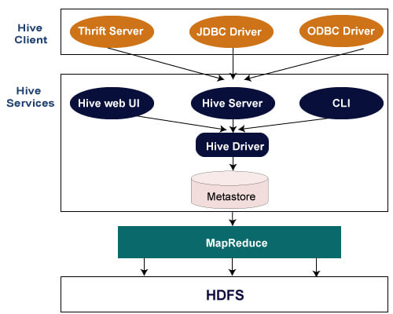

#### 7.1.1 Hive Client

Hive allows writing applications in various languages, including Java, Python, and C++. It supports different types of clients such as:-

- Thrift Server - It is a cross-language service provider platform that serves the request from all those programming languages that supports Thrift.
- JDBC Driver - It is used to establish a connection between hive and Java applications. The JDBC Driver is present in the class org.apache.hadoop.hive.jdbc.HiveDriver.
- ODBC Driver - It allows the applications that support the ODBC protocol to connect to Hive.

#### 7.1.2 Hive Services

The following are the services provided by Hive:-

- Hive CLI - The Hive CLI (Command Line Interface) is a shell where we can execute Hive queries and commands.
- Hive Web User Interface - The Hive Web UI is just an alternative of Hive CLI. It provides a web-based GUI for executing Hive queries and commands.
- Hive MetaStore - It is a central repository that stores all the structure information of various tables and partitions in the warehouse. It also includes metadata of column and its type information, the serializers and deserializers which is used to read and write data and the corresponding HDFS files where the data is stored.
- Hive Server - It is referred to as Apache Thrift Server. It accepts the request from different clients and provides it to Hive Driver.
- Hive Driver - It receives queries from different sources like web UI, CLI, Thrift, and JDBC/ODBC driver. It transfers the queries to the compiler.
- Hive Compiler - The purpose of the compiler is to parse the query and perform semantic analysis on the different query blocks and expressions. It converts HiveQL statements into MapReduce jobs.
- Hive Execution Engine - Optimizer generates the logical plan in the form of DAG of map-reduce tasks and HDFS tasks. In the end, the execution engine executes the incoming tasks in the order of their dependencies.

### 7.2 Hive Installation

#### 7.2.1 Pre-requisite

- **Java Installation** - Check whether the Java is installed or not using the following command.
  
  ```
  $ java -version
  
  Openjdk version "17.0.8" 2023-07-18
  OpenJDK Runtime Environment (build 17.0.8+7-Ubuntu-1)
  OpenJDK 64-Bit Server VM (build 17.0.8+7-Ubuntu-1, mixed mode, sharing)
           
  ```

- **Hadoop Installation** - Check whether the Hadoop is installed or not using the following command.
  
  ```
  $ hadoop version
  
  Hadoop 3.3.6
  Source code repository https://github.com/apache/hadoop.git -r 1be78238728da9266a4f88195058f08fd012bf9c
  Compiled by ubuntu on 2023-06-18T08:22Z
  Compiled on platform linux-x86_64
  Compiled with protoc 3.7.1
  From source with checksum 5652179ad55f76cb287d9c633bb53bbd
  This command was run using /home/bigdata/apache/hadoop/share/hadoop/common/hadoop-common-3.3.6.jar
  ```

#### 7.2.2 Steps to install Apache Hive

- Download the Apache Hive tar file.
  
  https://dlcdn.apache.org/hive/
  
  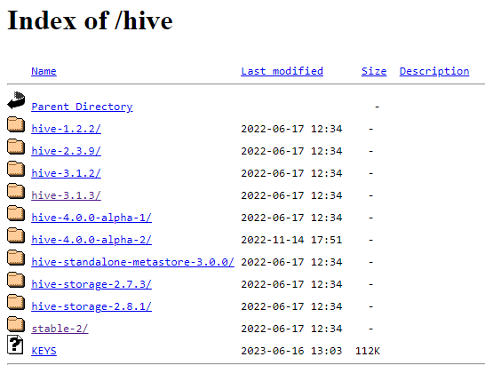

- Unzip the downloaded tar file.

        tar -xvf apache-hive-<version>-bin.tar.gz

- Move apache-hive<version> folder to ~/apache/

- Open and edit the .bashrc file. Add the following paths:
  
  ```
    export HIVE_HOME=~/apache/apache_hive  
    export PATH=$PATH:$HIVE_HOME/bin 
  ```

- Update the environment variable
  
  ```
  $ source ~/.bashrc
  ```

- Edit hive-site.xml
  
  ```
  <configuraion>
  
  <property>
  <name>system:java.io.tmpdir</name>
  <value>/tmp/hive</value>
  </property>
  
  <property>
  <name>hive.metastore.local</name>
  <value>TRUE</value>
  </property>
  
  <property>
  <name>hive.metastore.warehouse.dir</name>
  <value>/usr/hive/warehouse</value>
  </property>
  
  <property>
  <name>javax.jdo.option.ConnectionURL</name>
  <value>jdbc:derby:;databaseName=metastore_db;create=true</value>
  <description>
    JDBC connect string for a JDBC metastore.
    To use SSL to encrypt/authenticate the connection, provide database-specific SSL flag in the connection URL.
    For example, jdbc:postgresql://myhost/db?ssl=true for postgres database.
  </description>
  </property>
  
  </configuraion>
  ```

- Create the HDFS paths needed for hive (*hive.metastore.warehouse.dir* paramater in *hive-site.xml)*:
  
  ```
  hdfs dfs -mkdir -p /usr/hive/warehouse                                   
  ```

#### 7.2.3 Local / Embedded Metastore Database (Derby)

Hive works by leveraging the MapReduce framework and uses the tables and schemas to create the mappers and reducers for the MapReduce jobs that are run behind the scenes. In order to maintain the metadata about the data, Hive uses Derby which is an easy to use database. 

- Download Apache Derby
  
  In this section, we will look at installing Derby to be used in our Hive installation, https://db.apache.org/derby/derby_downloads.html
  
  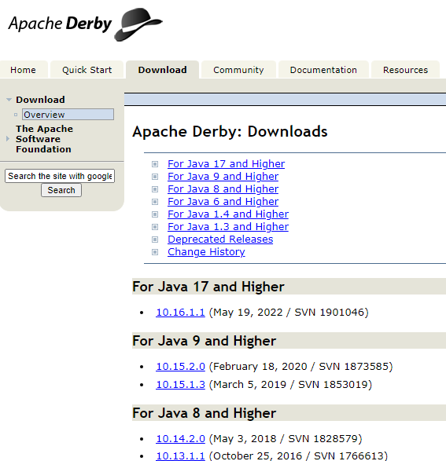
  
     

- Extract Derby using a command, as shown in the following code:
  tar -xvzf db-derby-<version>-bin.tar.gz
  
  ```
  tar -xvzf db-derby-10.16.1.1-bin.tar.gz
  ```

- Move db-derby-10.16.1.1 to ~/apache, and rename to dbderby.
  
  ```
  $ mv ~/Downloads/db-derby-10.16.1.1 ~/apache/dbderby
  ```

- Edit .bashrc file, and add the following parameters:
  
  ```
  export HIVE_HOME=/home/bigdata/apache/hive
  export DERBY_HOME=/home/bigdata/apache/dbderby
  export PATH=$PATH:$HIVE_HOME/bin:$DERBY_HOME/bin
  mkdir $DERBY_HOME/data
  cp $DERBY_HOME/lib/derbyclient.jar $HIVE_HOME/lib
  cp $DERBY_HOME/lib/derbytools.jar $HIVE_HOME/lib
  ```

- Now, start up the Derby server using a simple command, as shown in the
  following code:
  
  ```
  nohup startNetworkServer -h 0.0.0.0
  ```

- Once this is done, you have to create and initialize the derby instance:
  
  ```
  schematool -dbType derby -initSchema --verbose
  ```

- Now, you are ready to open the hive console:
  
  ```
  $ hive
  ```

### 7.3 Using Hive

As opposed to relational data warehouses, nested data models have complex types such as array, map, and struct. We can partition tables based on the values of one or more columns with the PARTITIONED BY clause. Moreover, tables or partitions can be bucketed using CLUSTERED BY columns, and data can be sorted within that bucket via SORT BY columns:

- Tables: They are very similar to RDBMS tables and contain rows and tables.

- Partitions: Hive tables can have more than one partition. They are mapped to
  subdirectories and filesystems as well.

- Buckets: Data can also be divided into buckets in Hive. They can be stored as
  files in partitions in the underlying filesystem.

The Hive query language provides the basic SQL-like operations. Here are few of the tasks that HQL can do easily:

- Create and manage tables and partitions

- Support various relational, arithmetic, and logical operators

- Evaluate functions

- Download the contents of a table to a local directory or the results of queries to
  the HDFS directory

##### 73.1 Creating Database

We first have to create a database to hold all the tables created in Hive. This step is easy and similar to most other databases:

```
create database mydb;
```

Check database

```
show databases;
```

Connect to database

```
use mydb;
```

##### 7.3.2 Creating Table

Once we have created a database, we are ready to create a table in the database. The table creation is syntactically similar to most RDBMS (database systems such as Oracle, MySQL).

First download OnlineRetail.csv file from URL: https://raw.githubusercontent.com/bigb0ss/Retail-atasets/master/Online%20Retail.csv

Put OnlineRetail.csv into HDFS /user/normal/

```
hdfs dfs -put /home/bigdata/Downloads/OnlineRetail.csv /user/normal/
```

Create external table

```
create external table OnlineRetail (
InvoiceNo string,
StockCode string,
Description string,
Quantity integer,
InvoiceDate string,
UnitPrice float,
CustomerID string,
Country string
) ROW FORMAT DELIMITED
FIELDS TERMINATED BY ','
LOCATION '/user/normal';
```

##### 7.3.3 Select some table rows

```
SELECT * from onlineretail LIMIT 5;
```

```
SELECT * FROM OnlineRetail WHERE Description='WHITE METAL LANTERN' limit 5;
```


## 8. Apache Spark

### 8.1 Installation

Spark is Hadoop’s sub-project. Therefore, it is better to install Spark into a Linux based system. The following steps show how to install Apache Spark.

#### Step 1: Verifying Java Installation

Java installation is one of the mandatory things in installing Spark. Try the following command to verify the JAVA version.

$ java -version

openjdk version "17.0.7" 2023-04-18
OpenJDK Runtime Environment (build 17.0.7+7-Ubuntu-0ubuntu122.04.2)
OpenJDK 64-Bit Server VM (build 17.0.7+7-Ubuntu-0ubuntu122.04.2, mixed mode, sharing)

#### Step 2: Verifying Scala installation

You should Scala language to implement Spark. So let us verify Scala installation using following command.

```
$ scala -version

Scala code runner version 3.3.0 -- Copyright 2002-2023, LAMP/EPFL
```

In case you don’t have Scala installed on your system, then proceed to next step for Scala installation.

Download the latest version of Scala by visit the following link

https://www.scala-lang.org/download/

```
curl -fL https://github.com/coursier/coursier/releases/latest/download/cs-x86_64-pc-linux.gz | gzip -d > cs && chmod +x cs && ./cs setup
```

#### Step 3: Downloading Apache Spark

Download the latest version of Spark by visiting the following link [Download Spark](https://spark.apache.org/downloads.html). After downloading it, you will find the Spark tar file in the download folder.

#### Step 4: Installing Spark

Follow the steps given below for installing Spark.

- Extracting Spark tar
  
  ```
  $ tar xvf spark-3.4.1-bin-hadoop3.tgz
  ```

- Moving Spark software files
  
  ```
  $ mv ~/Downloads/~spark-3.4.1-bin-hadoop3 ~/apache/spark
  ```

- Edit ~/.bashrc file, ad  the following parameters:
  
  ```
  export SPARK_HOME=~/apache/spark
  export PATH=$PATH:$SPARK_HOME/bin
  ```

- Reload ~/.bashrc
  
  ```
  $ source ~/.bashrc
  ```
  
                

#### Step 5: Verifying the Spark Installation

Write the following command for opening Spark shell.

Scala Spark:

```
$ spark-shell

3/08/14 09:58:35 WARN Utils: Your hostname, bd-vm resolves to a loopback address: 127.0.1.1; using 10.0.2.15 instead (on interface enp0s3)
23/08/14 09:58:35 WARN Utils: Set SPARK_LOCAL_IP if you need to bind to another address
Setting default log level to "WARN".
To adjust logging level use sc.setLogLevel(newLevel). For SparkR, use setLogLevel(newLevel).
Spark context Web UI available at http://worker01:4040
Spark context available as 'sc' (master = local[*], app id = local-1691981932999).
Spark session available as 'spark'.
Welcome to
      ____              __
     / __/__  ___ _____/ /__
    _/ // _ // _ `/ __/  '_/
   /___/ .__//_,_/_/ /_//_/   version 3.4.1
      /_/

Using Scala version 2.12.17 (OpenJDK 64-Bit Server VM, Java 17.0.8)
Type in expressions to have them evaluated.
Type :help for more information.

scala> 
```

Python Spark:

```
$ pyspark


Python 3.11.4 (main, Jun  7 2023, 10:13:09) [GCC 12.3.0] on linux
Type "help", "copyright", "credits" or "license" for more information.
23/08/14 10:01:57 WARN Utils: Your hostname, bd-vm resolves to a loopback address: 127.0.1.1; using 10.0.2.15 instead (on interface enp0s3)
23/08/14 10:01:57 WARN Utils: Set SPARK_LOCAL_IP if you need to bind to another address
Setting default log level to "WARN".
To adjust logging level use sc.setLogLevel(newLevel). For SparkR, use setLogLevel(newLevel).
23/08/14 10:01:59 WARN HiveConf: HiveConf of name hive.metastore.local does not exist
Welcome to
      ____              __
     / __/__  ___ _____/ /__
    _/ // _ // _ `/ __/  '_/
   /__ / .__//_,_/_/ /_//_/   version 3.4.1
      /_/

Using Python version 3.11.4 (main, Jun  7 2023 10:13:09)
Spark context Web UI available at http://worker01:4040
Spark context available as 'sc' (master = local[*], app id = local-1691982120907).
SparkSession available as 'spark'.
>>> 
```

### 8.1 Start Standalone Spark Master Server

Now that you have completed configuring your environment for Spark, you can start a master server.

In the terminal, type:

```
start-master.sh
```

To view the Spark Web user interface, open a web browser and enter the [localhost IP address](127-0-0-1-localhost.md) on port 8080.

```
http://127.0.0.1:8080/
or
http://localhost:8080/
or 
http://<master server IP address>:8080
or
http://<devicename>:8080
```

The page shows your **Spark URL**, status information for workers, hardware resource utilization, etc.


## Start Spark Slave Server (Start a Worker Process)

In this single-server, standalone setup, we will start one slave server along with the master server.

To do so, run the following command in this format:

```
start-worker.sh spark://master:port
```

The **`master`** in the command can be an IP or hostname.

In our case it is **`bd-vm`**:

```
start-worker.sh spark://bd-vm:7077
```

Now that a worker is up and running, if you reload Spark Master’s Web UI, you should see it on the list:

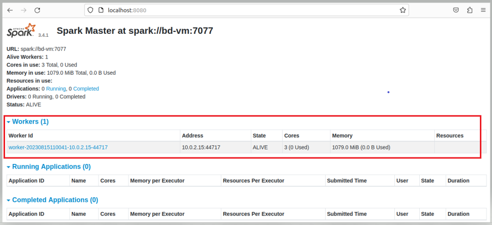

### Specify Resource Allocation for Workers

The default setting when starting a worker on a machine is to use all available CPU cores. You can specify the number of cores by passing the **`-c`** flag to the **`start-slave`** command.

For example, to start a worker and assign only **one CPU core** to it, enter this command:

```
start-worker.sh -c 1 spark://bd-vm:7077
```

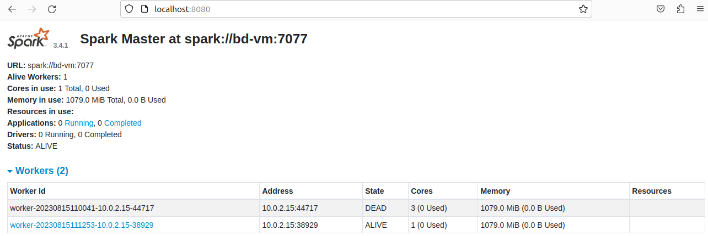

Similarly, you can assign a specific amount of memory when starting a worker. The default setting is to use whatever amount of RAM your machine has, minus 1GB.

To start a worker and assign it a specific amount of memory, add the **`-m`** option and a number. For gigabytes, use **`G`** and for megabytes, use **`M`**.

For example, to start a worker with 512MB of memory, enter this command:

```
start-worker.sh -m 512M spark://bd-vm:707
```

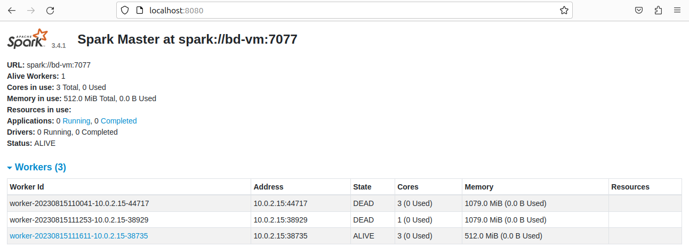

## Basic Commands to Start and Stop Master Server and Workers

Below are the basic commands for starting and stopping the Apache Spark master server and workers. Since this setup is only for one machine, the scripts you run default to the localhost.

**To start** **a master** **server** instance on the current machine, run the command we used earlier in the guide:

```
start-master.sh
```

**To stop the master** instance started by executing the script above, run:

```
stop-master.sh
```

**To stop a running worker** process, enter this command:

```
stop-worker.sh
```

You can **start both master and server** instances by using the start-all .spark.sh command:

<u>Note</u>: 

To distinguish between two files with the same name in $HADOOP_HOME/sbin, rename the files name in $SPARK_HOME/sbin :

```
mv $SPARK_HOME/sbin/start-all.sh $SPARK_HOME/sbin/start-all-spark.sh
mv $SPARK_HOME/sbin/stop-all.sh $SPARK_HOME/sbin/stop-all-spark.sh
```

```
start-all-spark.sh
```


Similarly, you **can stop all instances** by using the following command:

```
stop-all-spark.sh
```

### 8.2 Using Spark

#### 8.2.1 Scala (spark-shell)

```
$ cd $SPARK_HOME
$ pwd
/home/bigdata/apache/spark
$ ls
bin   data      jars        LICENSE   NOTICE  R          RELEASE  yarn
conf  examples  kubernetes  licenses  python  README.md  sbin 

Task:
How many lines contain "Spark" in README.md file ?


Solution with spark scala (spark-shell):

$ spark-shell
textFile: org.apache.spark.sql.Dataset[String] = [value: string]

scala> textFile.count() // Number of items in this Dataset
res0: Long = 125                                                                

scala> textFile.first() // First item in this Dataset
res1: String = # Apache Spark

scala> val linesWithSpark = textFile.filter(line => line.contains("Spark"))
linesWithSpark: org.apache.spark.sql.Dataset[String] = [value: string]

scala> textFile.filter(line => line.contains("Spark")).count() // How many lines contain "Spark"?
res2: Long = 20

scala> :q

==> Thera are 20 Spark word in README.md file.
```

#### 8.2.2 Spark (pyspark)

```
>>> textFile = spark.read.text("README.md")
>>> textFile.count()  # Number of rows in this DataFrame
125                                                                             
>>> textFile.first()  # First row in this DataFrame
Row(value='# Apache Spark')
>>> linesWithSpark = textFile.filter(textFile.value.contains("Spark"))
>>> textFile.filter(textFile.value.contains("Spark")).count()  # How many lines contain "Spark"?
20
>>> quit()

==> Thera are 20 Spark word in README.md file.
```
